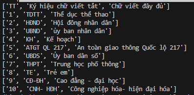

🌎 English | [Vietnamese](README_vn.md)
# Recognition-Table-with-Table_Transformer-and-vietOCR
This repository is used to detect and recognize tables using Table Transformer and vietOCR. It is a module developed from my [Vietnamese_OCR_documents](https://github.com/KaiKenju/Vietnamese_OCR_documents) repository

## 🛠️ Setup

- Clone  this project:

```[bash]
git clone https://github.com/KaiKenju/Recognition-Table-with-Table_Transformer-and-vietOCR?tab=readme-ov-file
```

- Initial enviromment with Miniconda:

```[bash]
conda create -n <env_name> python=3.8
```
- Activate conda
```[bash]
conda activate <env_name> 
```
- Download pre-train weight
download from here: [transformerocr](https://drive.google.com/file/d/1g3-Hi4oigfbrrNFZxQCh5qhEYjZU2_Ar/view?usp=drive_link)
 
- Run the commands:
```[bash]
pip install -r requirements.txt
```

## ▶️ Run
* 🔥 if you want to understand how the system works, please run:
```[bash]
python main.py
```
* ✅ else, end to end process:
```[bash]
python run.py
```

## 📝 Result

<p align="center" >
  
  
  
</p>
<p align="center">
  <strong>Original Image </strong> &nbsp;&nbsp;&nbsp;&nbsp;&nbsp;&nbsp;&nbsp;&nbsp;&nbsp;&nbsp;&nbsp;&nbsp;&nbsp;&nbsp;&nbsp;&nbsp;&nbsp;&nbsp;&nbsp;&nbsp;&nbsp;&nbsp;&nbsp;&nbsp;&nbsp;&nbsp;&nbsp;&nbsp;&nbsp;&nbsp;
  <strong>Detect Table </strong> &nbsp;&nbsp;&nbsp;&nbsp;&nbsp;&nbsp;&nbsp;&nbsp;&nbsp;&nbsp;&nbsp;&nbsp;&nbsp;&nbsp;&nbsp;&nbsp;&nbsp;&nbsp;&nbsp;&nbsp;&nbsp;
  <strong>Cropped Table </strong>
</p>

<p align="center">
  
  
  
</p>
<p align="center">
  <strong>&nbsp;&nbsp;&nbsp;&nbsp;&nbsp;&nbsp;&nbsp;&nbsp;&nbsp;&nbsp;&nbsp;&nbsp;</strong>
  <strong>Detect Cells</strong> &nbsp;&nbsp;&nbsp;&nbsp;&nbsp;&nbsp;&nbsp;&nbsp;&nbsp;&nbsp;&nbsp;&nbsp;&nbsp;&nbsp;&nbsp;&nbsp;&nbsp;&nbsp;&nbsp;&nbsp;&nbsp;
  <strong>&nbsp;&nbsp;&nbsp;&nbsp; Detect row by row</strong> &nbsp;&nbsp;&nbsp;&nbsp;&nbsp;&nbsp;&nbsp;&nbsp;&nbsp;&nbsp;&nbsp;&nbsp;&nbsp;&nbsp;&nbsp;&nbsp;
  <strong>Recognition each cell</strong>&nbsp;&nbsp;&nbsp;&nbsp;&nbsp;
</p>


## 🚀 Structure Project
```[bash]
Recognition-Table-with-Table_Transformer-and-vietOCR/
          ├── config/                   # configuration files and options for OCR system
          ├── files/                    # file pdf,word after OCR for web-app using Fast-api
          ├── images/                   # images to test
          ├── output/                   # output excel file .xlsx
          ├── weight/                   # weight file
          ├── TATR.ipynb                # core model
          ├── Core_OCR.ipynb            # notebook paddleOCR + vietOCR
          ├── main.py                   # 
          ├── pre_processing.py         # pre-processing
          ├── run.py                    # how to model work well
          ├── requirements.txt     
          ├── README.md                 # english version
          ├── README_vn.md              # vietnamese version
```
## 🚀 Overview

## 🚀 Detection: Table Transformer


## ⚡ Recognition: VietOCR

