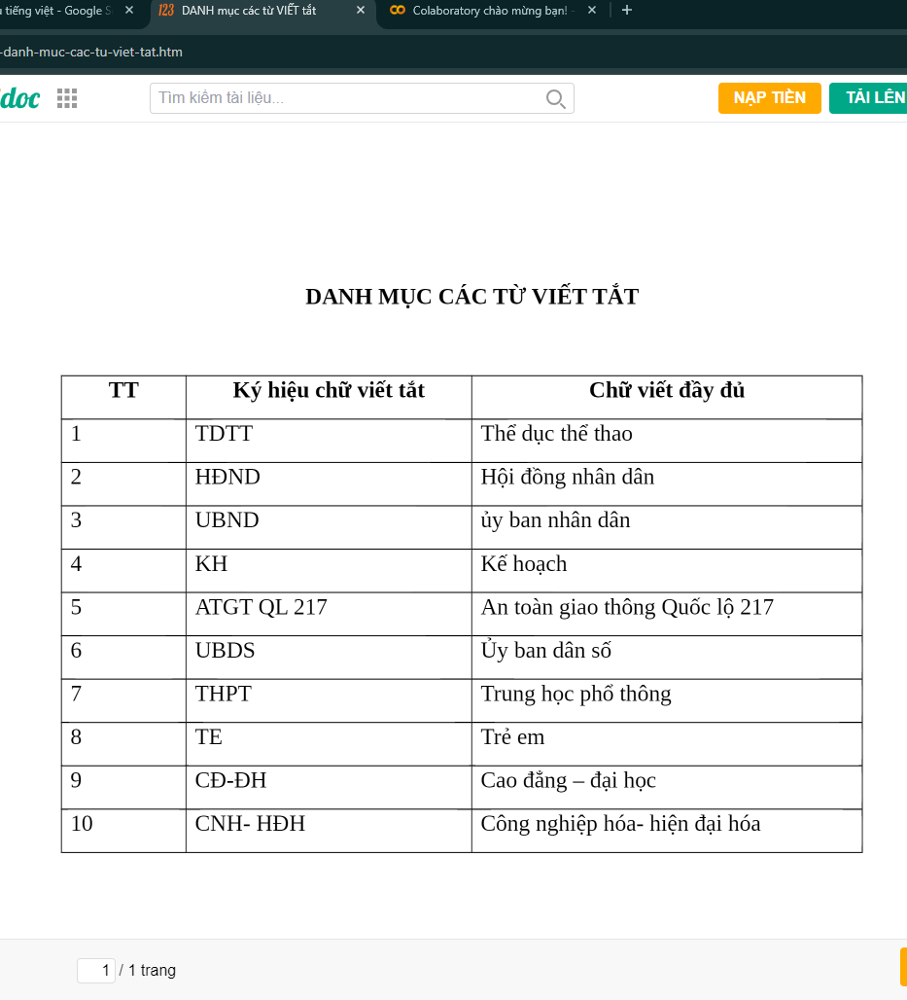
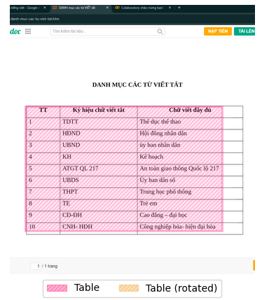
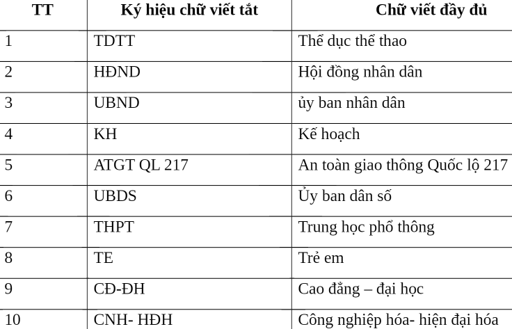
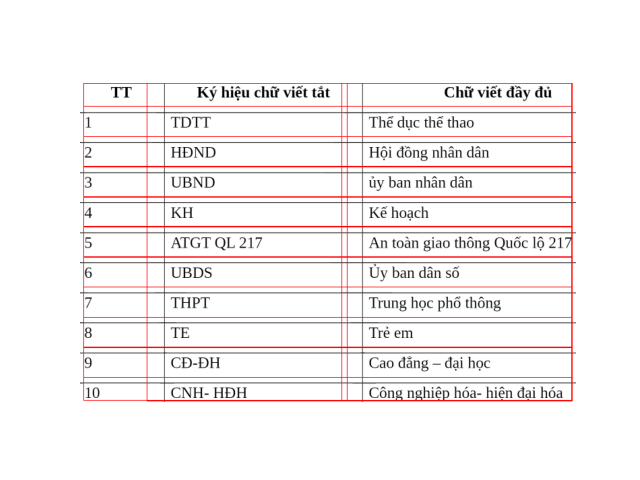
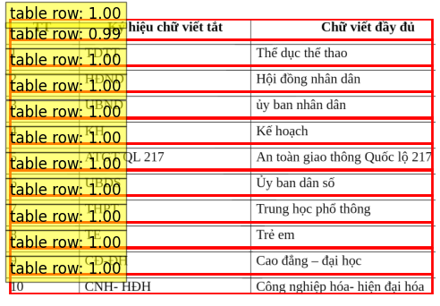

🌎 English | [Vietnamese](README_vn.md)
# Recognition-Table-with-Table_Transformer-and-vietOCR
This repository is used to detect and recognize tables using Table Transformer and vietOCR. It is a module developed from my [Vietnamese_OCR_documents](https://github.com/KaiKenju/Vietnamese_OCR_documents) repository

## 🛠️ Setup

- Clone  this project:

```[bash]
git clone https://github.com/KaiKenju/Recognition-Table-with-Table_Transformer-and-vietOCR?tab=readme-ov-file
```

- Initial enviromment with Miniconda:

```[bash]
conda create -n <env_name> python=3.8
```
- Activate conda
```[bash]
conda activate <env_name> 
cd Vietnamese_OCR_documents
```
- Run the commands:
```[bash]
pip install -r requirements.txt
```

## ▶️ Run
* 🔥 if you want to understand how the system works, please run:
```[bash]
python main.py
```
* ✅ else, end to end process:
```[bash]
python run.py
```

## 📝 Result
<!-- Dòng đầu tiên với 3 ảnh -->
<p align="center">
  
  
  
</p>

<!-- Dòng thứ hai với 2 ảnh -->
<p align="center">
  
  
</p>


## 🚀 Structure Project
```[bash]
Vietnamese_OCR_Documents/
          ├── assets/                   # contains image to OCR
          ├── config/                   #  configuration files and options for OCR system
          ├── cropped_images/           # Images are cropped for recognition purposes
          ├── folder_file_api/          # file pdf,word after OCR for web-app using Fast-api
          ├── weight/                   # The weight  of system
          ├── PaddleOCR/                # Paddle repositories
          ├── static/                   # front-end 
          ├── app.py                    # demo web(local-host) using FastAPI 
          ├── Core_OCR.ipynb            # notebook paddleOCR + vietOCR
          ├── image_processing.py       # image processing
          ├── main.py 
          ├── performance_thread.py     # performance optimization (faster main.py using thread)
          ├── Pretrained_vietOCR.ipynb  # training VietOCR
          ├── requirements.txt     
          ├── README.md                 # english version
          ├── README_vn.md              # vietnamese version
```
## 🚀 Detection: PaddleOCR

neww
## ⚡ Recognition: VietOCR

