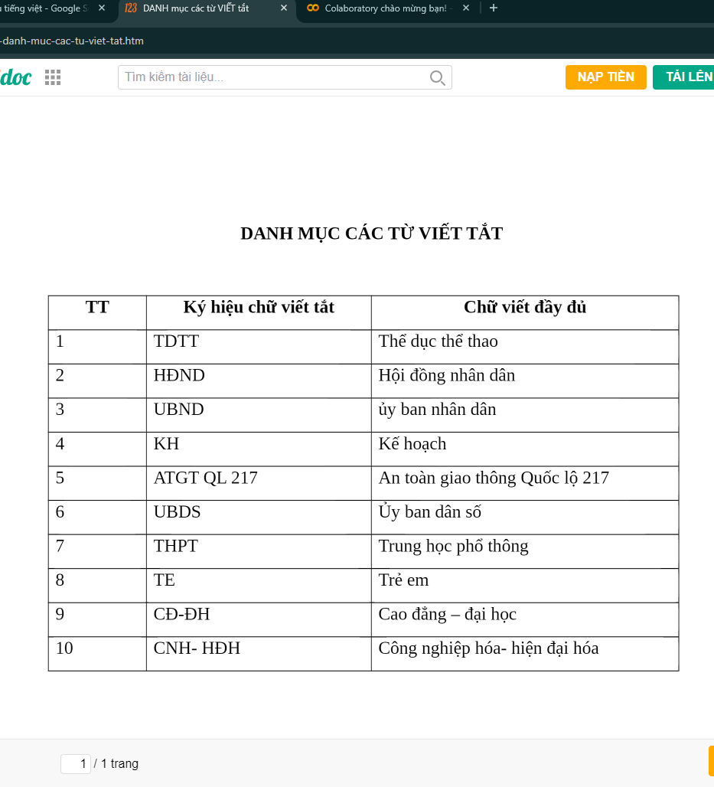
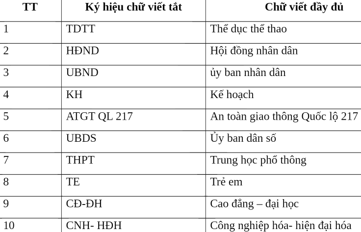

🌎 [English] | Vietnamese(README.md)
# Recognition-Table-with-Table_Transformer-and-vietOCR
Repo này được phát triển và sử dụng để phát hiện và nhận dạng các bảng bằng Table Transformer và vietOCR. Đây là một mô-đun được phát triển từ [Vietnamese_OCR_documents](https://github.com/KaiKenju/Vietnamese_OCR_documents) repository của tôi.

## 🛠️ Setup

- Clone  project:

```[bash]
git clone https://github.com/KaiKenju/Recognition-Table-with-Table_Transformer-and-vietOCR?tab=readme-ov-file
```

- Khởi tạo môi trường với Miniconda:

```[bash]
conda create -n <env_name> python=3.8
```
- Kích hoạt conda
```[bash]
conda activate <env_name> 
```
- Download pre-train weight
download from here: [transformerocr](https://drive.google.com/file/d/1g3-Hi4oigfbrrNFZxQCh5qhEYjZU2_Ar/view?usp=drive_link)
 
- Run the commands:
```[bash]
pip install -r requirements.txt
```

## ▶️ Run
* 🔥 Nếu bạn muốn hiểu cách mà mô hình hoạt động, từng bước thì chạy:
```[bash]
python run.py
```
* ✅ còn nếu ko thì:
```[bash]
python main.py
```

## 📝 Kết quả

<p align="center" >
  
  
  
</p>
<p align="center">
  <strong>Input </strong> &nbsp;&nbsp;&nbsp;&nbsp;&nbsp;&nbsp;&nbsp;&nbsp;&nbsp;&nbsp;&nbsp;&nbsp;&nbsp;&nbsp;&nbsp;&nbsp;&nbsp;&nbsp;&nbsp;&nbsp;&nbsp;&nbsp;&nbsp;&nbsp;&nbsp;&nbsp;&nbsp;&nbsp;&nbsp;&nbsp;
  <strong>Phát hiện bảng </strong> &nbsp;&nbsp;&nbsp;&nbsp;&nbsp;&nbsp;&nbsp;&nbsp;&nbsp;&nbsp;&nbsp;&nbsp;&nbsp;&nbsp;&nbsp;&nbsp;&nbsp;&nbsp;&nbsp;&nbsp;&nbsp;
  <strong>Cắt bảng </strong>
</p>

<p align="center">
  
  
  
</p>
<p align="center">
  <strong>&nbsp;&nbsp;&nbsp;&nbsp;&nbsp;&nbsp;&nbsp;&nbsp;&nbsp;&nbsp;&nbsp;&nbsp;&nbsp;&nbsp;&nbsp;&nbsp;&nbsp;&nbsp;&nbsp;&nbsp;&nbsp;&nbsp;&nbsp;&nbsp;</strong>
  <strong>Phát hiện các cells</strong> &nbsp;&nbsp;&nbsp;&nbsp;&nbsp;&nbsp;&nbsp;&nbsp;&nbsp;&nbsp;&nbsp;&nbsp;&nbsp;&nbsp;
  <strong>&nbsp;&nbsp;&nbsp;&nbsp; Phát hiện từng dòng một</strong> &nbsp;&nbsp;&nbsp;&nbsp;&nbsp;&nbsp;&nbsp;&nbsp;&nbsp;&nbsp;&nbsp;&nbsp;&nbsp;&nbsp;&nbsp;
  <strong>Nhận diện từng dòng</strong>&nbsp;&nbsp;&nbsp;&nbsp;&nbsp;&nbsp;&nbsp;&nbsp;&nbsp;&nbsp;&nbsp;&nbsp;&nbsp;&nbsp;&nbsp;&nbsp;&nbsp;&nbsp;&nbsp;&nbsp;&nbsp;&nbsp;&nbsp;
</p>


## 🚀 Structure Project
```[bash]
Recognition-Table-with-Table_Transformer-and-vietOCR/
          ├── config/                   # cấu hình và tùy chọn cho hệ thống OCR
          ├── files/                    # 
          ├── images/                   # ảnh để thử nghiệm
          ├── output/                   # đầu ra  excel file .xlsx
          ├── weight/                   # file weight mô hình
          ├── TATR.ipynb                # core model
          ├── Core_OCR.ipynb            # notebook Table transformer + vietOCR/EasyOCR
          ├── main.py                   # 
          ├── pre_processing.py         # pre-processing
          ├── run.py                    # chạy để hiểu mô hình hoạt động như nào
          ├── requirements.txt     
          ├── README.md                 # bản tiếng anh
          ├── README_vn.md              # bản tiếng việt
```
## 🚀 Overview

## 🚀 Detection: Table Transformer


## ⚡ Recognition: VietOCR

